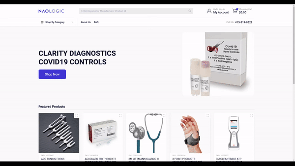

# Naologic - Ecommerce


1.  [Install](#install)
2.  [Getting started](#getting-started)
3.  [Project structure](docs/PROJECT_STRUCTURE.md)
4.  [Freelancer job post](docs/FREELANCE_JOB.md)
5.  [License](#license)
5.  [Naologic](#naologic)

## :bulb: Features

- :racehorse: user registration, login and notifications
- :open_mouth: search 100.000+ products with variants in under 500ms
- :zap: product quick view
- :boom: advanced product definitions
- :hammer: create custom price lists on a per-user basis
- :bug: free bug fixes
- :cyclone: top navigation optimized for thousands of categories
- :milky_way: compare products and features
- :raised_hands: create product lists and add them to cart automatically
- :star2: add your own logo, colors, partners, about us etc

## Install

Clone the repository
```bash
git clone https://github.com/naologic/ecommerce-storefront-b2b
```

Install the npm dependencies. Sometimes you might need to pass `--legacy-peer-deps` flag
```bash
npm install --legacy-peer-deps
```

Serve the project locally to `localhost:4200`
```bash
nx serve
```

## Deployment as a static page
Static pages offer great performance at low cost and auto-scale with the number of requests.

### Deploy to [Vercel](vercel.com)

1. pick your repository
2. go to "Configure Project"
3. open "Build and Output Settings"
4. set the "OUTPUT DIRECTORY" to "dist/apps/ecommerce-storefront-b2b"
5. open "Environment Variables" and set values from your [naologic](https://naologic.com) account
   1. set `API_URL` to `api url value from Tokens` 
   2. set `NAO_TOKEN` to `token value from Tokens`
6. Enjoy :rocket:

### Deploy to [Cloudflare Pages](https://pages.cloudflare.com/)

1. pick your repository
2. open "Root directory (advanced)" and set "dist/apps/ecommerce-storefront-b2b"
5. open "Environment Variables" and set values from your [naologic](https://naologic.com) account
    1. set `API_URL` to `api url value from Tokens`
    2. set `NAO_TOKEN` to `token value from Tokens`
6. Enjoy :rocket:

## License

Distributed under the MIT License. See `LICENSE` for more information.

## [Naologic](https://naologic.com)
Naologic is enterprise resource planning (ERP) no-code platform that gives small businesses just like yours access to
sophisticated business management tools that big companies use -- no coding required. 

You can manage products, orders, invoices, suppliers, customers and more with our no-code apps

:tada: [Just sign up for a free trial today!](https://naologic.com/industries/supply-chain-distribution-for-wholesale-business)

